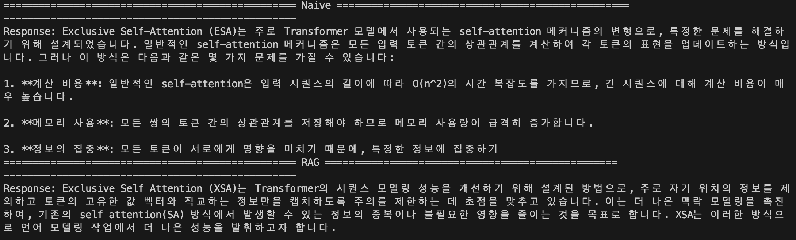

## TL;DR
### Prototype 완성 / 전체적인 파이프라인 형성
* load -> chunking -> embedding  
* retrieve -> LLM

위 형태의 파이프라인을 정하고 실제 RAG가 제대로 동작하는지 확인하였음

**2026년 3월 10일**에 나온 논문의 내용(실험 당시 5일전)에 대해 Naive버전과 RAG버전을 비교하였음. 
**Naive버전은 논문의 이름부터 틀리는 반면 RAG를 사용하였을 때는 전반적인 방법론도 찾는 것을 볼 수 있었음.**



source : https://arxiv.org/pdf/2603.09078

> RAG가 성공적으로 작동하였다는 사실은 확인하였고 추후 RAG 성능 및 퀄리티를 디벨로할 예정


## Work Log
### loader.py
논문을 읽는 것이 목적이기 때문에 이에 따라 PyPDFLoader를 사용하여 load

### chunker.py
CharacterTextSplitter를 사용함
```
text_splitter = CharacterTextSplitter(
        chunk_size=500, 
        chunk_overlap=50, 
        separator = '. '
    )
```
1. 작동방식은 separtor를 기준으로 텍스트를 자른다.
-  이때 chunk_size보다 긴 구간동안 seperator가 나오지 않으면 ㅇ하나의 chunk에 넣을 수 있다. 
2. 나누어진 텍스트들이 chunk_size를 넘지 않는 선에서 최대한 합친다. 

```
from langchain_text_splitters import RecursiveCharacterTextSplitter
```
여러 separator를 두고 싶으면 다음 클래스를 사용하면 된다.

> 각 chunk의 기본정보(pdf기준)는 {page_content, {source, page}}이고 본 프로젝트에서는 chunk_id를 추가하였다.

### embedder.py
- 임베딩 모델 : Qwen/Qwen3-Embedding-0.6B
    - 사용이유 : 가벼운 오픈소스
- vectorDB : Chroma

기존에 만들어진 DB가 있다면 해당 DB를 가져와 추가하는 방식이고 없다면 새롭게 생성한다.(현재 로직으로는 같은 파일이 여러 번 저장가능하고 이는 추후에 수정해야함)

### ingest.py
위 3개의 파일을 직렬로 이어붙이 형태로 pdf를 입력으로 받고 vectorDB에 저장하는 행위가 출력으로 나온다

### retriever.py
특이사항 없음

### chat.py
OpenAI의 gpt-4o-mini 모델을 사용하여 chatting